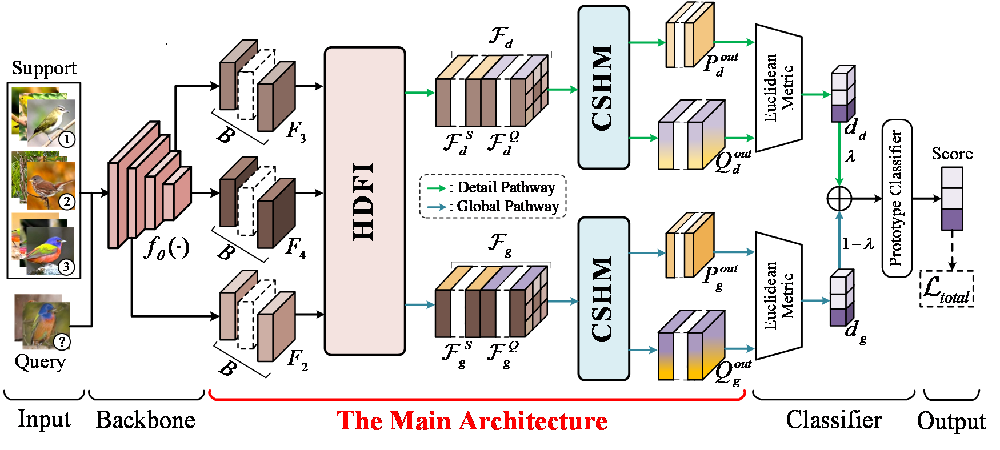

# Hierarchical Discriminative Feature Refinement for Few-Shot Fine-Grained Image Classification

## 📋 Data Preparation

The following benchmark datasets are used in our experiments:

- **CUB-200-2011**: [Dataset Page](http://www.vision.caltech.edu/visipedia/CUB-200-2011.html)
- **Stanford Dogs**: [Dataset Page](http://vision.stanford.edu/aditya86/ImageNetDogs/)
- **Stanford Cars**: [Dataset Page](http://ai.stanford.edu/~jkrause/cars/car_dataset.html)
- **FGVC-Aircraft**: [Dataset Page](https://www.robots.ox.ac.uk/~vgg/data/fgvc-aircraft/)

Our code is built upon the [C2-Net GitHub](https://github.com/MaZhenxing-Dlut/C2-Net) repository. We thank the authors for their open-source contributions.